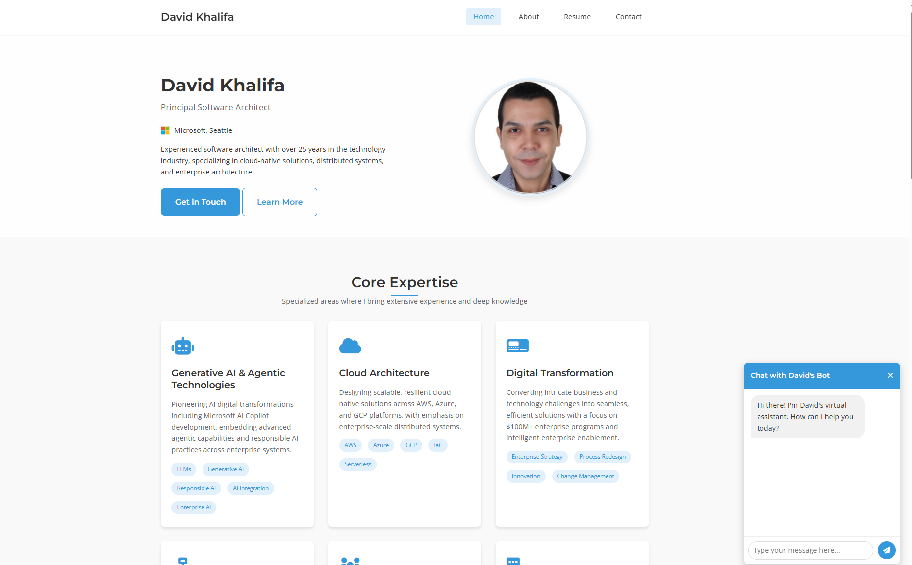
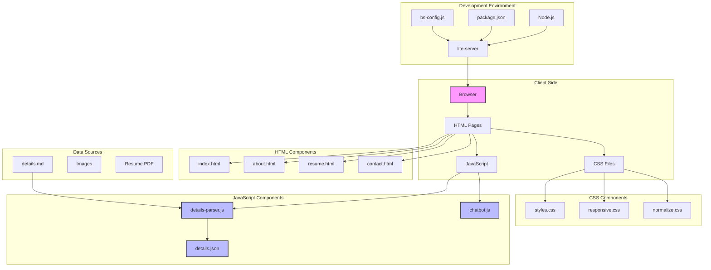

# Modern Personal Website

A modern, responsive personal website template built with HTML, CSS, and JavaScript, featuring a clean design, interactive components, and easy customization options.



## 📋 Table of Contents

- [Features](#-features)
- [Architecture](#-architecture)
- [Project Structure](#-project-structure)
- [Getting Started](#-getting-started)
  - [Prerequisites](#prerequisites)
  - [Installation](#installation)
  - [Running the Development Server](#running-the-development-server)
- [Customization](#-customization)
  - [Personalizing Content](#personalizing-content)
  - [Styling](#styling)
- [Components](#-components)
- [Troubleshooting](#-troubleshooting)
- [Contributing](#-contributing)
- [License](#-license)

## 🚀 Features

- **Responsive Design**: Optimized for all device sizes from mobile to desktop
- **Card-Based Layouts**: Modern design with reusable card components
- **Interactive Timeline**: Visual representation of professional history
- **Dynamic Content Loading**: Content management using a simple markdown file
- **Expandable FAQ Section**: Interactive accordion for frequently asked questions
- **Google Maps Integration**: Location display on the contact page
- **Chatbot**: Simple AI-like interaction for quick information access
- **Accessibility**: Built with proper semantic HTML and ARIA attributes
- **Modern Animations**: Subtle transitions and interactions

## 🏗 Architecture

The website follows a clean, component-based architecture with separate concerns for structure (HTML), presentation (CSS), and behavior (JavaScript).



### Data Flow

1. **Initial Setup**:
   * User information is stored in `details.md` in Markdown format
   * `details-parser.js` converts the markdown to structured JSON data
   * The resulting `details.json` contains all personal information

2. **Page Load Process**:
   * HTML pages load with minimal static content
   * CSS files provide styling and responsive design
   * JavaScript loads the structured JSON data
   * DOM is populated dynamically with personal information

3. **User Interactions**:
   * Timeline navigation events handled by JavaScript
   * FAQ accordion expand/collapse managed by event listeners
   * Contact form validated before submission
   * Chatbot responds to user queries with keyword matching

## 📁 Project Structure

```
MyWebSite/
│
├── package.json             # Node.js dependencies and scripts
├── bs-config.js             # Configuration for lite-server
│
├── public/
│   ├── index.html           # Home page
│   ├── about.html           # About page with professional history
│   ├── resume.html          # Resume page with downloadable PDF
│   ├── contact.html         # Contact page with form and map
│   │
│   ├── css/
│   │   ├── styles.css       # Main styles
│   │   ├── responsive.css   # Media queries for responsiveness
│   │   └── normalize.css    # CSS normalization
│   │
│   ├── js/
│   │   ├── details-parser.js # Converts details.md to details.json
│   │   ├── details.json     # Personal information in JSON format
│   │   └── chatbot/
│   │       └── chatbot.js   # Chatbot functionality
│   │
│   ├── images/
│   │   ├── profile.png      # Profile photo
│   │   ├── microsoft-logo.svg # Company logo
│   │   ├── icons/           # Icons for company logos, education, etc.
│   │   └── [other images]   # Additional images
│   │
│   └── resume/
│       └── david-khalifa-resume.pdf  # Resume PDF
│
└── guide/
    ├── copilot-instructions.md # Project specifications
    ├── details.md              # Markdown template for personal information
```

## 🚦 Getting Started

### Prerequisites

- [Node.js](https://nodejs.org/) (version 14 or higher)
- npm (comes with Node.js)
- Modern web browser

### Installation

1. Clone the repository:
   ```bash
   git clone https://github.com/yourusername/MyWebSite.git
   cd MyWebSite
   ```

2. Install dependencies:
   ```bash
   npm install
   ```

### Running the Development Server

1. Start the local development server:
   ```bash
   npm start
   ```

2. Open your browser and navigate to:
   ```
   http://localhost:3000
   ```

## ✏️ Customization

### Personalizing Content

To personalize the website content, edit the `guide/details.md` file. This file follows a specific structure that is parsed into JSON data by the `details-parser.js` script.

The structure includes sections for:
- Basic Information (name, job title, company)
- Summary (professional overview)
- Contact Information
- Professional Skills
- Professional Experience
- Education
- Testimonials
- Project Highlights
- Core Expertise
- FAQ

After editing the `details.md` file, the changes will automatically be reflected in the website when you reload the page.

### Styling

The website uses a consistent color scheme defined in CSS variables. To modify the color scheme, edit the `:root` section in `public/css/styles.css`:

```css
:root {
  --primary-color: #3498db;
  --secondary-color: #2ecc71;
  --accent-color: #e74c3c;
  --background-color: #f9f9f9;
  --text-color: #333333;
  --card-bg-color: #ffffff;
  --timeline-color: #3498db;
}
```

## 🧩 Components

The website includes several reusable components:

### 1. Card Components

Used for displaying expertise areas, projects, and testimonials with consistent styling.

### 2. Timeline Component

An interactive timeline for displaying professional history with navigation controls.

### 3. FAQ Accordion

Expandable/collapsible sections for frequently asked questions.

### 4. Chatbot

A simple interactive chat interface accessible from all pages.

### 5. Contact Form

A styled, validated form for user messages.

### 6. Google Maps Integration

Location display using the Google Maps iframe API.

## ❓ Troubleshooting

**Issue**: Content doesn't update after editing `details.md`
- Solution: Make sure the development server is running and refresh the page completely (Ctrl+F5)

**Issue**: Development server doesn't start
- Solution: Check that you have Node.js installed and all dependencies are installed using `npm install`

**Issue**: Images not displaying
- Solution: Verify file paths in the HTML and ensure image files are in the correct directories

## 🤝 Contributing

Contributions are welcome! Please feel free to submit a Pull Request.

## 📄 License

This project is licensed under the MIT License - see the LICENSE file for details.