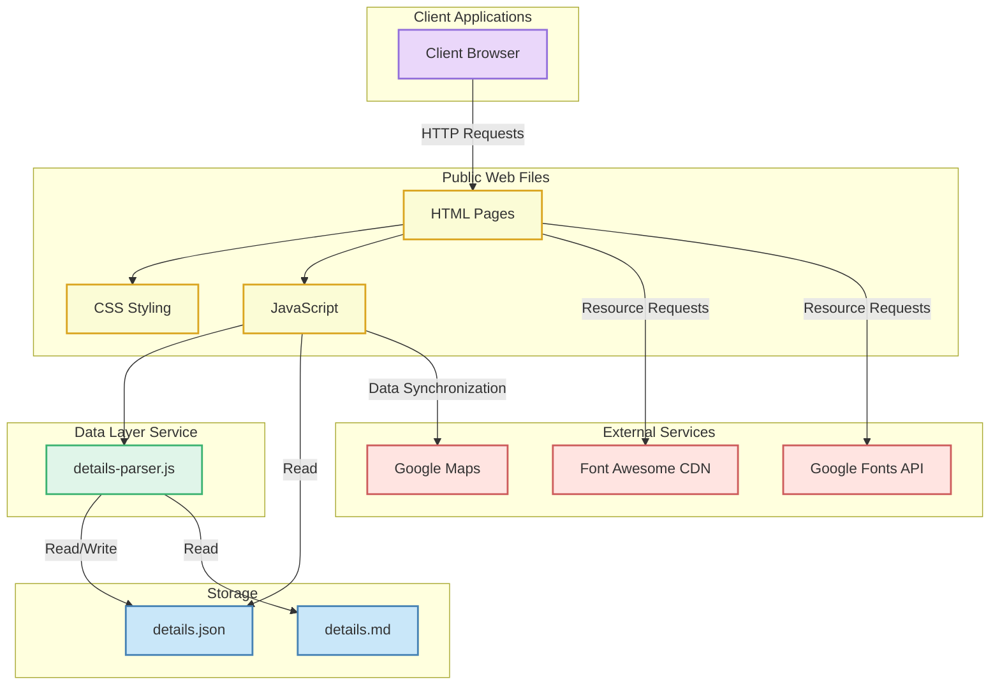
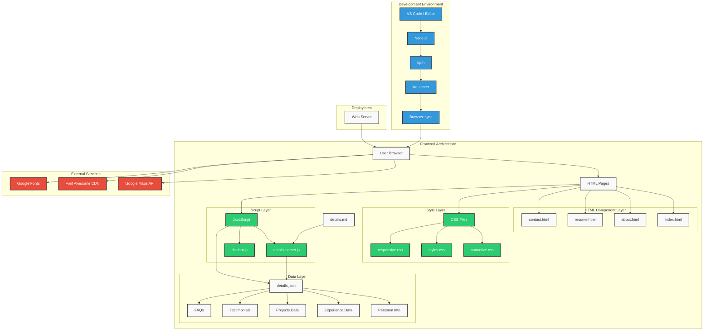
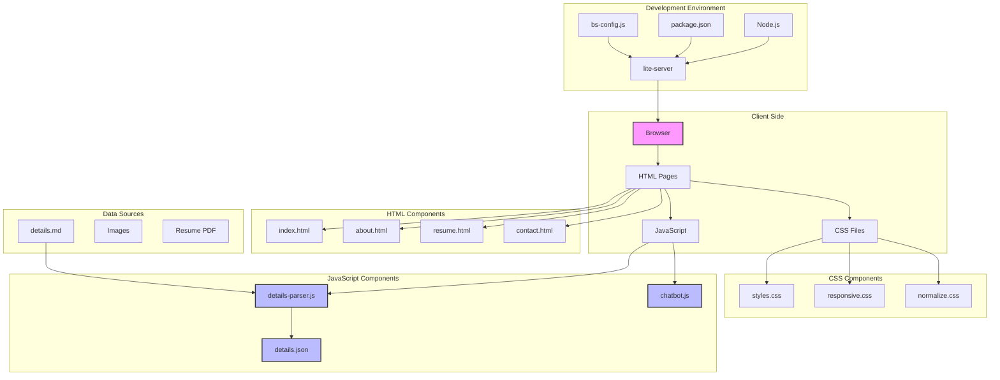
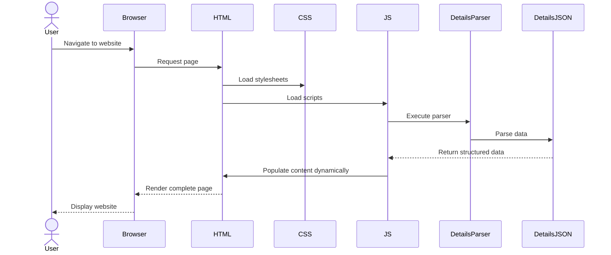
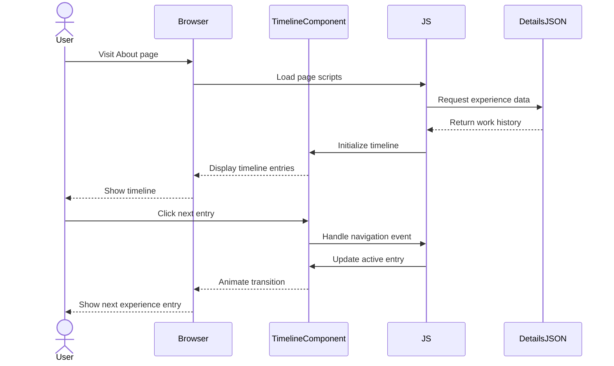
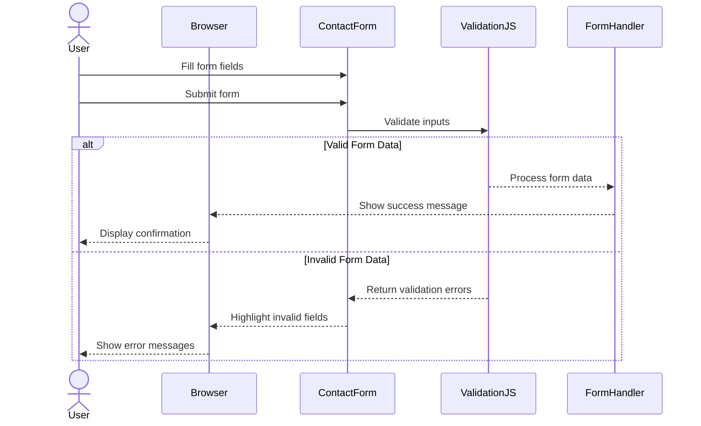
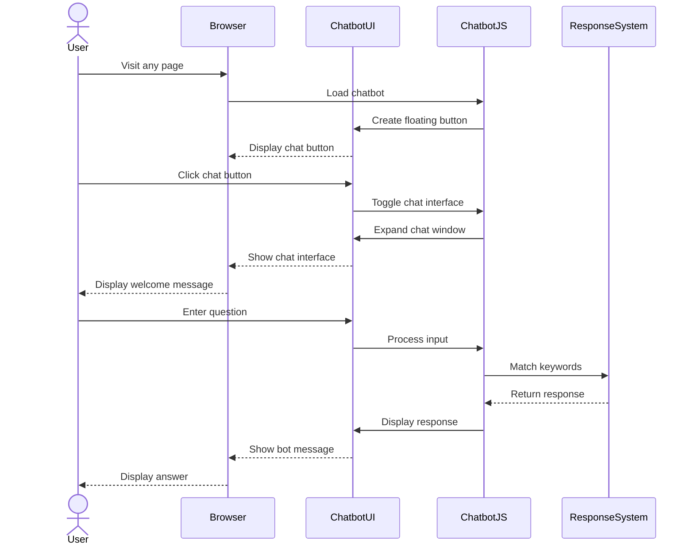
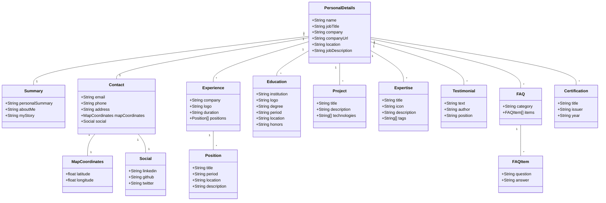

# MyWebSite Architecture Documentation

## Table of Contents
- [Overview](#overview)
- [High-Level Architecture](#high-level-architecture)
- [System Architecture](#system-architecture)
- [Project Structure](#project-structure)
- [Architecture Diagram](#architecture-diagram)
- [Sequence Diagrams](#sequence-diagrams)
- [Data Models](#data-models)
- [Key Components](#key-components)
- [Technologies Used](#technologies-used)
- [Data Flow](#data-flow)
- [Development Environment](#development-environment)

## Overview

The MyWebSite project is a modern, responsive personal website for David Khalifa, a Principal Software Architect at Microsoft. The website showcases professional experience, skills, and achievements through a multi-page structure with interactive components. The architecture follows best practices for web development including responsive design, component-based structure, and clean separation of concerns.

This documentation provides a comprehensive overview of the project's architecture, including diagrams, data models, and key components.

## High-Level Architecture



## System Architecture



## Project Structure

```
MyWebSite/
│
├── package.json             # Node.js dependencies and scripts
├── bs-config.js             # Configuration for lite-server
│
├── public/
│   ├── index.html           # Home page
│   ├── about.html           # About page with professional history
│   ├── resume.html          # Resume page with downloadable PDF
│   ├── contact.html         # Contact page with form and map
│   │
│   ├── css/
│   │   ├── styles.css       # Main styles
│   │   ├── responsive.css   # Media queries for responsiveness
│   │   └── normalize.css    # CSS normalization
│   │
│   ├── js/
│   │   ├── details-parser.js # Converts details.md to details.json
│   │   ├── details.json     # Personal information in JSON format
│   │   └── chatbot/
│   │       └── chatbot.js   # Chatbot functionality
│   │
│   ├── images/
│   │   ├── profile.png      # Profile photo
│   │   ├── microsoft-logo.svg # Company logo
│   │   ├── icons/           # Icons for company logos, education, etc.
│   │   └── [other images]   # Additional images
│   │
│   └── resume/
│       └── david-khalifa-resume.pdf  # Resume PDF
│
└── guide/
    ├── copilot-instructions.md # Project specifications
    ├── details_example.md      # Example markdown template 
    ├── details.md              # Markdown template for personal information
    └── github-agent-prompt.md  # GitHub agent instructions
```

## Architecture Diagram

Below is the overall architecture diagram of the MyWebSite project:



## Sequence Diagrams

### Website Load and Initialization Sequence



### User Interaction with Timeline Component



### Contact Form Submission Sequence



### Chatbot Interaction Flow



## Data Models

The project uses a structured JSON data model to store all personal information. This model is generated from the `details.md` markdown file using the `details-parser.js` script.

### Core Data Model



## Key Components

### 1. HTML Pages

* **index.html** - Home page with profile information, core expertise, project highlights, and testimonials
* **about.html** - Personal profile, professional journey with interactive timeline, skills, education
* **resume.html** - Downloadable resume, work experience timeline, project highlights, FAQ section
* **contact.html** - Contact form, professional information, social links, Google Maps integration

### 2. CSS Structure

* **normalize.css** - CSS reset for consistent cross-browser rendering
* **styles.css** - Main stylesheet with CSS variables, typography, layout, and component styling
* **responsive.css** - Media queries for responsive design across different device sizes

### 3. JavaScript Components

* **details-parser.js** - Converts `details.md` into structured JSON format
* **details.json** - Stores all personal data to be loaded dynamically into the website
* **chatbot.js** - Implements chatbot functionality with keyword-based responses

### 4. UI Components

* **Navigation** - Responsive menu with mobile hamburger toggle
* **Card Components** - Reusable design for expertise, projects, and testimonials
* **Timeline Component** - Interactive display of professional history
* **FAQ Accordion** - Expandable/collapsible sections for questions and answers
* **Contact Form** - Form with validation for user interaction
* **Chatbot** - Floating chat interface for quick answers
* **Google Maps Integration** - Location display on contact page

## Technologies Used

* **Frontend**:
  * HTML5 (Semantic markup)
  * CSS3 (Variables, Flexbox, Grid, Animations)
  * JavaScript (ES6+)
  * Font Awesome (Icons)
  * Google Fonts (Typography)

* **Development Environment**:
  * Node.js
  * lite-server (local development server)
  * Browser-sync (live reload)

## Data Flow

1. **Initial Setup**:
   * User information is stored in `details.md` in Markdown format
   * `details-parser.js` converts the markdown to structured JSON data
   * The resulting `details.json` contains all personal information

2. **Page Load Process**:
   * HTML pages load with minimal static content
   * CSS files provide styling and responsive design
   * JavaScript loads the structured JSON data
   * DOM is populated dynamically with personal information

3. **User Interactions**:
   * Timeline navigation events handled by JavaScript
   * FAQ accordion expand/collapse managed by event listeners
   * Contact form validated before submission
   * Chatbot responds to user queries with keyword matching

## Development Environment

* **Local Development Server**: lite-server configured with browser-sync
* **Configuration**: bs-config.js defines server settings
* **Dependencies**: Managed through package.json
* **Installation**: Uses npm for package management
* **Run**: `npm start` launches local development server